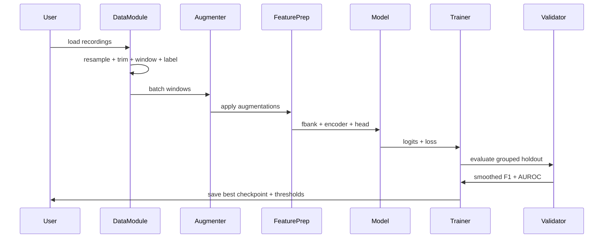
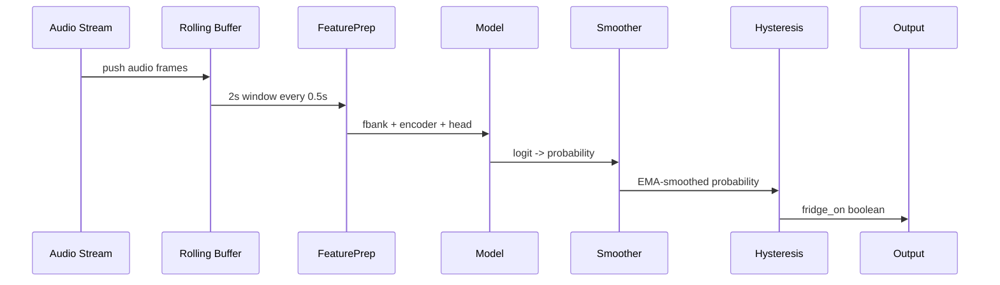

# Fridge Compressor Noise Detection — System Specification

## 1. Purpose and Scope

Build a **binary acoustic classifier** that runs on live audio to report one of two states:

1. **Fridge compressor ON**
2. **Fridge compressor OFF**

The system must:

- Train from **eight 3‑minute steady-state clips** captured with **fixed mic and placement**.
- Use **BEATs** as the backbone with a small task head.
- Support **streaming inference** with **smoothing + hysteresis** to avoid flicker.
- Treat **AC blower noise as a nuisance** and explicitly model it as an auxiliary task.
- Deliver **data prep + training + evaluation + streaming** as a complete, coherent pipeline.

No legacy code, no backwards compatibility, no fallback behaviors.

---

## 2. System Overview

### 2.1 High-Level Pipeline

1. **Data Ingest & Canonicalization**
2. **Windowing + Labeling**
3. **Feature Prep (BEATs native fbank)**
4. **Training (two-stage fine-tune, multitask)**
5. **Validation (grouped holdout by recording/environment)**
6. **Streaming Inference (EMA + hysteresis)**

### 2.2 Core Design Choices

- **Sampling**: 16 kHz mono.
- **Windows**: 2.0 s with 1.0 s hop for training/validation.
- **BEATs Preprocessing**: Kaldi fbank, 128 mel bins, 25 ms window, 10 ms hop.
- **Pooling**: Mean pooling over BEATs frame sequence.
- **Head**: Light MLP with dropout.
- **Multi-task**: Primary fridge on/off + auxiliary AC on/off.
- **Smoothing**: EMA of probabilities; hysteresis thresholds for state changes.

---

## 3. Data and Labeling

### 3.1 Source Recordings

Eight steady-state clips (3 minutes each) from fixed mic placement.
Each file is labeled with:

- `fridge_on` ∈ {0, 1}
- `ac_on` ∈ {0, 1}
- `environment` ∈ {day, night}

### 3.2 Canonicalization

All audio inputs must be transformed to:

- Sample rate: **16,000 Hz**
- Channels: **mono**
- Format: uncompressed WAV for disk artifacts, or float tensor in memory

No per-file normalization (do not normalize to 0 dBFS).

### 3.3 Trim Rules

To remove non-stationary artifacts:

- Trim **first 8–10 seconds**
- Trim **last 3–5 seconds**

Default: `trim_start_s = 10`, `trim_end_s = 5`.

### 3.4 Windowing Strategy

Treat each 3‑minute clip as many supervised windows.

Training windows:

- `win_len = 2.0 s`
- `hop = 1.0 s`
- Label each window with clip-level fridge/AC labels.

Evaluation windows:

- Same as training for fairness.

### 3.5 Splitting Strategy

Avoid leakage by **grouped split by recording**.

Default split (hardest environment holdout):

Validation:

- ac-on, night, fridge off
- ac-on, night, fridge on

Training:

- all remaining 6 recordings

Optional: 4-fold “environment holdout” where each fold validates on one pair:

- (ac-on, night)
- (ac-on, day)
- (ac-off, night)
- (ac-off, day)

---

## 4. Feature Preparation

### 4.1 BEATs Preprocessing (Required)

Use BEATs’ native feature pipeline:

- Kaldi fbank
- 128 mel bins
- 25 ms window, 10 ms hop
- Mean/std normalization (BEATs constants)

No custom spectrograms.

---

## 5. Model Architecture

### 5.1 Backbone

- **BEATs_iter3_plus_AS2M.pt** as the encoder
- Transformer outputs framewise features

### 5.2 Pooling

- **Mean pooling** over time frames

### 5.3 Head (Primary + Auxiliary)

Main classifier:

- `LayerNorm`
- `Linear(d_model → 128)`
- `GELU`
- `Dropout(p=0.2)`
- `Linear(128 → 1)` → logit for `fridge_on`

Aux classifier (AC):

- Same MLP structure, separate output: `ac_on`

### 5.4 Loss

Binary cross entropy with logits:

- `L_fridge = BCEWithLogits(fridge_logit, fridge_label)`
- `L_ac = BCEWithLogits(ac_logit, ac_label)`

Total:

```
L = L_fridge + 0.3 * L_ac
```

---

## 6. Training

### 6.1 Optimizer & Schedule

- Optimizer: **AdamW**
- Weight decay: `0.01`
- Gradient clip: `1.0`
- Schedule: **warmup + cosine decay**
  - Warmup fraction: `0.05`

### 6.2 Two-Stage Fine-Tuning

**Stage 1 (head stabilization):**

- Freeze full BEATs backbone.
- Train only head(s).
- Epochs: `5–10`
- LR head: `1e-3`

**Stage 2 (partial adaptation):**

- Unfreeze last **2 transformer blocks** + final norm.
- Epochs: `10–30`, with early stopping.
- LR backbone: `1e-5`
- LR head: `3e-4`
- Early stopping patience: `5` on grouped validation.

### 6.3 Batch and Accumulation

- Default batch size: `32` windows.
- If memory constrained: `16` with gradient accumulation ×2.

---

## 7. Augmentation

Augmentations are mandatory unless explicitly disabled in config.

### 7.1 Gain Jitter (mandatory)

- Random gain in `[-6, +6] dB`

### 7.2 Time Shift (mandatory)

- Random shift inside window: ±0.25 s

### 7.3 Noise Mixing from Own Clips (high impact)

- Build noise pool from **fridge-off windows**.
- With probability `0.5`, mix noise at SNR `[0, 20] dB`.

Hard negatives:

- Occasionally mix **fridge-on snippets** into fridge-off windows at high SNR (15–25 dB).

### 7.4 SpecAugment (optional but recommended)

On fbank features (before BEATs encoder):

- Time masks: 1–2 masks, up to 10–20 frames.
- Frequency mask: 1 mask, up to 8–16 mel bins.

---

## 8. Evaluation

### 8.1 Metrics

Evaluate both **window-level** and **streaming-level** performance:

- Window AUROC
- Window accuracy / F1
- **Smoothed F1** using streaming logic

### 8.2 Model Selection Criterion

Primary: **Smoothed F1** on grouped validation.
Secondary: Window AUROC.

---

## 9. Streaming Inference

### 9.1 Runtime Windowing

- Buffer length: `2.0 s`
- Update interval: `0.5 s` (or `1.0 s` for lower CPU)

### 9.2 Probability Smoothing

```
p = sigmoid(logit)
p_ema = alpha * p + (1 - alpha) * p_ema_prev
```

Default: `alpha = 0.2`

### 9.3 Hysteresis

- Turn **ON** if `p_ema >= 0.65`
- Turn **OFF** if `p_ema <= 0.35`
- Otherwise, hold previous state

Thresholds tuned by sweep on validation recordings to maximize smoothed F1.

---

## 10. Components and Responsibilities

### 10.1 Data Module

- Load raw audio files
- Resample to 16 kHz mono
- Trim edges
- Window and label
- Provide grouped splits

### 10.2 Augmentation Module

- Gain jitter
- Time shift
- Noise mixing from internal pool
- Optional SpecAugment

### 10.3 Feature Module

- BEATs fbank preprocessing
- Normalization

### 10.4 Model Module

- BEATs backbone loader
- Pooling
- MLP heads (fridge + AC)

### 10.5 Training Module

- Two-stage fine-tune
- Optimizer, scheduler
- Early stopping
- Metrics tracking

### 10.6 Evaluation Module

- Grouped validation
- Window metrics
- Smoothed metrics
- Threshold sweep and selection

### 10.7 Streaming Module

- Rolling buffer for inference
- EMA smoothing
- Hysteresis state machine
- Status emission: `fridge_on` boolean

---

## 11. Configuration (Authoritative)

All tunable parameters are centralized in a single YAML config.

```yaml
audio:
  sample_rate: 16000
  mono: true
  trim_start_s: 10
  trim_end_s: 5

windows:
  train_win_s: 2.0
  train_hop_s: 1.0
  train_random_crop_s: [1.5, 3.0]
  eval_win_s: 2.0
  eval_hop_s: 1.0

model:
  backbone: BEATs_iter3_plus_AS2M.pt
  pooling: mean
  head:
    mlp_hidden: 128
    dropout: 0.2
  multitask:
    enabled: true
    aux_ac_weight: 0.3

train:
  optimizer: adamw
  weight_decay: 0.01
  grad_clip: 1.0
  schedule: warmup_cosine
  warmup_frac: 0.05

  stage1:
    freeze_backbone: true
    epochs: 8
    lr_head: 1e-3

  stage2:
    unfreeze_last_blocks: 2
    epochs: 25
    lr_backbone: 1e-5
    lr_head: 3e-4
    early_stopping_patience: 5

augment:
  gain_db: [-6, 6]
  time_shift_s: 0.25
  mix_noise:
    p: 0.5
    snr_db: [0, 20]
  specaugment:
    enabled: true
    time_masks: 2
    time_mask_frames: 20
    freq_masks: 1
    freq_mask_bins: 12

streaming:
  buffer_s: 2.0
  update_every_s: 0.5
  ema_alpha: 0.2
  hysteresis_on: 0.65
  hysteresis_off: 0.35
```

---

## 12. Interaction Diagrams

### 12.1 Component Diagram


### 12.2 Training Sequence



### 12.3 Streaming Inference Sequence



---

## 13. Artifacts

Generated outputs:

- `checkpoints/` — model weights for best validation fold
- `metrics/` — per-epoch window + smoothed metrics
- `thresholds.yaml` — selected hysteresis thresholds
- `inference_config.yaml` — deployment-ready config

---

## 14. Testing and Validation Requirements

Minimum validations required before declaring “ready”:

- Grouped holdout (by recording) with AC-on night pair as validation
- Smoothed F1 and AUROC reported
- Threshold sweep results persisted
- Sanity-check: no clip-level leakage

---

## 15. Constraints and Non-Goals

Constraints:

- Use **uv** for Python environment and dependency management.
- No additional data collection required.
- Keep model small; no large head or end-to-end training from scratch.

Non-goals:

- Multi-class classification beyond fridge/AC.
- Generalization to different mic placements or apartments.
- Automatic data labeling beyond filename metadata.

---

## 16. Implementation Notes (Non-Normative)

- Training should be deterministic when possible (fixed seeds).
- Avoid excessive augmentation strength; compressor tonality must remain detectable.
- Favor smoothed metrics for selection, not raw window accuracy.

---

## 17. Acceptance Criteria

The system is considered complete when:

- A trained model checkpoint and thresholds exist.
- Streaming inference produces stable on/off states without flicker.
- Validation uses grouped holdout with the hardest environment.
- The entire pipeline can be re-run from raw clips with a single config.
