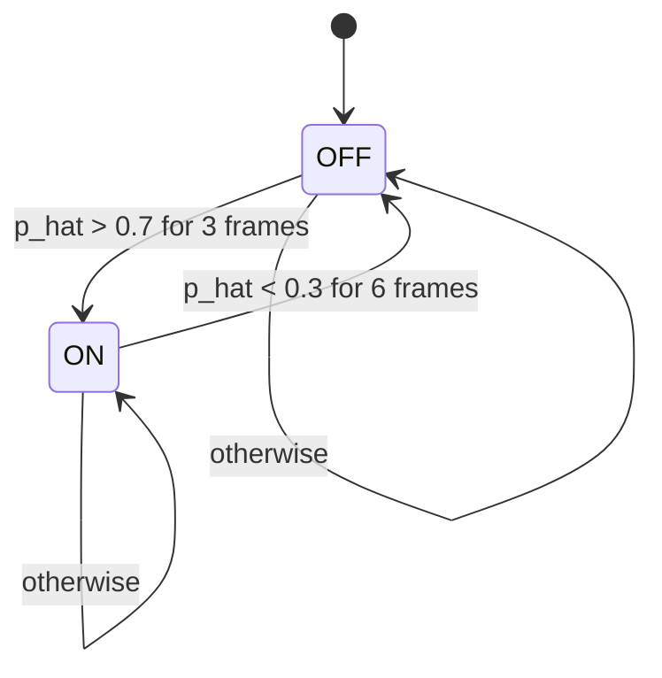
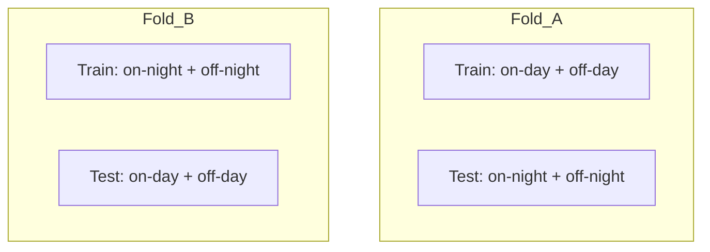

# SPEC: Fridge Compressor On/Off Detection System

This document defines the end-to-end target system for detecting a fridge compressor state (ON/OFF) from live apartment audio, plus the full data preparation and training workflow. It is derived directly from `THEORY.md` and is intended to be the authoritative implementation spec.

## 0) Scope, goals, and constraints

### Goals
- Live binary classification of fridge compressor state:
  - ON
  - OFF
- Reproducible, leak-free data prep and model training pipeline.
- Stable streaming output suitable for real-time monitoring.

### Non-goals
- No multi-class or multi-appliance classification.
- No automatic denoise, AGC, or "smart" audio preprocessing.
- No legacy compatibility or alternate backends.
- No fallback behaviors (if a step fails, it should fail loudly).

### Constraints
- Always use BEATs frontend and feature expectations.
- Use `uv` for Python environment and dependency management.
- Keep data splits leakage-free by grouping by recording.

---

## 1) Inputs and data sources

### Primary labeled recordings (initial dataset)
Four steady-state clips, each about 3 minutes:
- `fridge-on-day`
- `fridge-off-day`
- `fridge-on-night`
- `fridge-off-night`

Each clip's label is inherited by all windows extracted from it.

### Live audio stream
Raw microphone input in the apartment environment.

---

## 2) Audio ingest and normalization

### Decode + resample
- Mono, 16 kHz
- Float32 waveform
- Value range: `[-1, 1]`
- No denoise or AGC; use the same raw mic path as used during recording

### Rationale
Mic processing mismatches between training and live inference can silently break performance.

---

## 3) Feature extraction (BEATs-compatible)

### Frontend: Kaldi fbank
Use BEATs expected fbank configuration:

| Parameter | Value |
| --- | --- |
| `num_mel_bins` | 128 |
| `sample_frequency` | 16000 |
| `frame_length_ms` | 25 |
| `frame_shift_ms` | 10 |

### Normalization
Use BEATs normalization preset:

```
fbank_norm = (fbank - 15.41663) / (2 * 6.55582)
```

### Requirements
- Prefer BEATs `preprocess()` / official feature path.
- No alternative feature pipelines.

---

## 4) Windowing and labeling

### Windowing defaults

| Use | Window length | Hop |
| --- | --- | --- |
| Training | 2.0 s | 0.5 s |
| Streaming | 2.0 s | 0.25 s |

### Labeling
- Each window inherits the label of the source clip.
- No per-window loudness normalization.

### Expected counts
- A 3-minute clip yields about 357 windows at 2.0s/0.5s.
- Total about 1400 windows from the four recordings.

---

## 5) Dataset splitting (leak-free evaluation)

### Day vs night grouped 2-fold CV

**Fold A**
- Train: `fridge-on-day` + `fridge-off-day`
- Validate/Test: `fridge-on-night` + `fridge-off-night`

**Fold B**
- Train: `fridge-on-night` + `fridge-off-night`
- Validate/Test: `fridge-on-day` + `fridge-off-day`

### Final training for deployment
- Train on all four recordings.
- Select thresholds using:
  - A small held-out slice (last 15 seconds of each file), or
  - One fold's validation predictions.

---

## 6) Augmentation (label-preserving)

### Always-on
- Random gain: +/- 6 dB
- Random time shift within the window (circular shift or jitter)
- Optional mild EQ tilt (very small)

### Optional robustness
- Add external noise to both classes at random SNR (10 to 30 dB)
  - OFF: teaches random noise is not compressor
  - ON: teaches compressor persists under noise

### Forbidden
- No mixup between ON and OFF labels.

---

## 7) Model architecture

### Backbone
- BEATs: `BEATs_iter3_plus_AS2M.pt`
- Use last-layer features of shape `(B, T, C)`

### Pooling
- Default: mean pooling over time (T)

### Head

```
Linear(C -> 256)
GELU
Dropout(p=0.2)
Linear(256 -> 1)
```

### Loss
- `BCEWithLogitsLoss`

---

## 8) Training regimen

### Phase 1 (default)
- Freeze BEATs backbone
- Optimizer: AdamW
- Head LR: 1e-3
- Weight decay: 1e-2
- Batch size: 64
- Max epochs: 20
- Early stopping: patience 5
- Monitor: validation AUC and F1

### Phase 2 (only if needed)
Unfreeze last 2 transformer blocks.

| Parameter | Value |
| --- | --- |
| Backbone LR | 1e-5 |
| Head LR | 3e-4 |
| Warmup | 5% of steps |
| Scheduler | cosine decay |
| Epochs | 10 to 20 |
| Early stopping | patience 5 |

---

## 9) Evaluation and selection

### Metrics
- AUC
- F1
- Accuracy
- Confusion matrix

### Threshold selection
Use validation predictions to choose a decision threshold that maximizes F1, then apply a post-processing hysteresis layer for stable streaming output.

---

## 10) Streaming inference pipeline

### Core steps
1. **Ring buffer** holds 2.0s of audio at 16 kHz (32000 samples).
2. Every 0.25s (4000 samples), extract the latest 2.0s window.
3. Compute BEATs fbank features and normalize.
4. Run BEATs backbone + head to produce a logit.
5. Convert logit to probability with sigmoid.
6. Apply EMA smoothing.
7. Apply hysteresis + debounce to produce a stable boolean.

### Real-time latency
After the initial 2.0s buffer fill, ON detection requires 3 consecutive frames:
- Approximate detection delay: 0.75s (3 frames * 0.25s)
- OFF detection is more conservative: 6 frames = 1.5s

---

## 11) Post-processing: smoothing and hysteresis

### EMA smoothing

```
p_hat_t = 0.8 * p_hat_{t-1} + 0.2 * p_t
```

### Hysteresis + debounce defaults
- Turn ON if `p_hat > 0.7` for 3 consecutive frames
- Turn OFF if `p_hat < 0.3` for 6 consecutive frames

### State machine



---

## 12) Baseline diagnostic (not used in final output)

For sanity-checking live audio path:
- Compute log bandpower in 800 to 3000 Hz.
- Expect roughly 10x higher energy when compressor is ON.
- Use only as a diagnostic; no fallback to this baseline.

---

## 13) Components and interactions

### Offline pipeline (data prep + training)

```mermaid
flowchart LR
  A[Raw recordings] --> B[Decode + resample 16k mono]
  B --> C[Windowing 2.0s hop 0.5s]
  C --> D[BEATs fbank + norm]
  D --> E[BEATs backbone]
  E --> F[Mean pooling + MLP head]
  F --> G[Train + validate (grouped CV)]
  G --> H[Model + threshold config]
```

### Online pipeline (streaming inference)


### Cross-validation split (recording grouped)



---

## 14) Configuration parameters

All parameters are centralized and explicit (no hidden defaults).

### Audio
- `sample_rate = 16000`
- `mono = true`
- `dtype = float32`
- `value_range = [-1, 1]`

### Feature extraction
- `num_mel_bins = 128`
- `frame_length_ms = 25`
- `frame_shift_ms = 10`
- `fbank_mean = 15.41663`
- `fbank_std = 6.55582`
- `fbank_norm = (fbank - mean) / (2 * std)`

### Windowing
- `train_window_sec = 2.0`
- `train_hop_sec = 0.5`
- `stream_window_sec = 2.0`
- `stream_hop_sec = 0.25`

### Model
- `backbone = BEATs_iter3_plus_AS2M.pt`
- `pooling = mean`
- `head_hidden = 256`
- `dropout = 0.2`
- `loss = BCEWithLogitsLoss`

### Optimization
- `optimizer = AdamW`
- `lr_head = 1e-3`
- `weight_decay = 1e-2`
- `batch_size = 64`
- `epochs_max = 20`
- `early_stop_patience = 5`

### Fine-tuning (optional)
- `unfreeze_last_blocks = 2`
- `lr_backbone = 1e-5`
- `lr_head_ft = 3e-4`
- `warmup_ratio = 0.05`
- `scheduler = cosine`
- `epochs_ft = 10..20`

### Augmentation
- `gain_db = [-6, +6]`
- `time_shift = enabled`
- `eq_tilt = optional (small)`
- `noise_snr_db = 10..30 (optional)`

### Post-processing
- `ema_alpha = 0.8`
- `on_threshold = 0.7`
- `on_frames = 3`
- `off_threshold = 0.3`
- `off_frames = 6`

---

## 15) Artifacts and outputs

### Training outputs
- Model checkpoints (per fold and final).
- Final model weights.
- Evaluation report with metrics per fold.
- Selected decision thresholds and hysteresis config.

### Inference outputs
- Live boolean state (ON/OFF).
- Optional stream of probabilities for debugging.

---

## 16) Implementation notes

- Use BEATs source code at `reference/unilm/beats` for feature extraction consistency.
- Use `uv` for Python environments and dependency management.
- Avoid any implicit audio preprocessing in the capture path.
- No fallback behavior or legacy compatibility layers.

